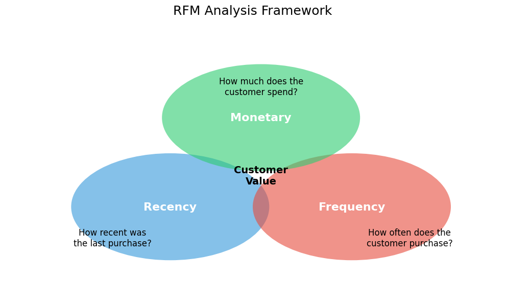
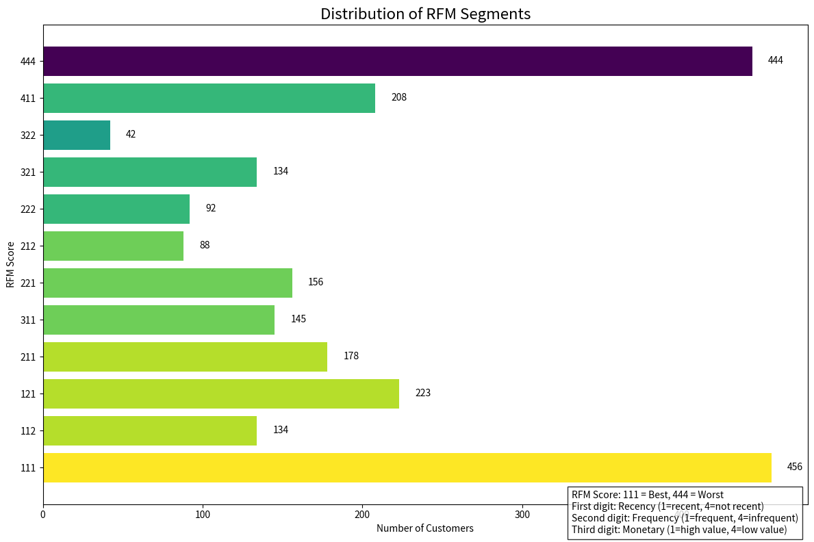
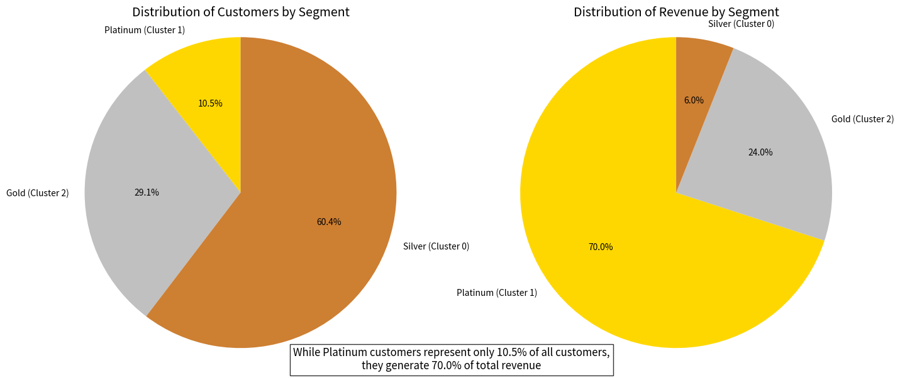
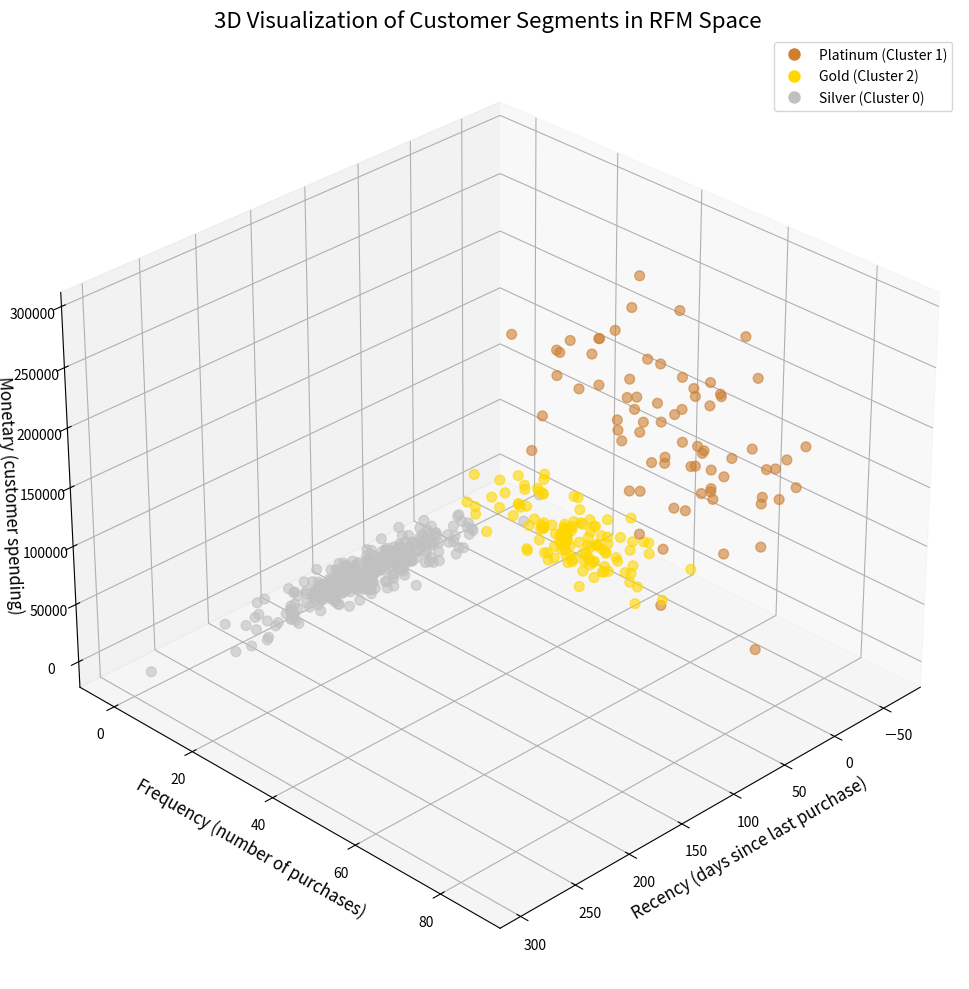
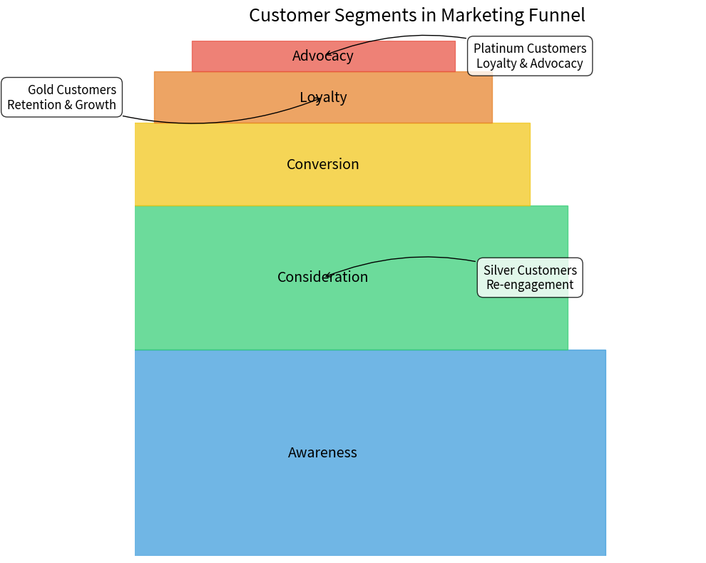

# RFM Analysis Project


<p align="center">
  
</p>

> Identify your high-value customers and optimize your marketing strategies with data-driven segmentation

## 📊 Project Overview

This repository contains a comprehensive implementation of RFM (Recency, Frequency, Monetary) analysis for customer segmentation using Python. RFM analysis is a powerful marketing technique used to quantitatively analyze and segment customers based on their purchasing behavior.

### What is RFM Analysis?

RFM stands for the three key dimensions of customer behavior:
- **Recency**: How recently did the customer purchase?
- **Frequency**: How often do they purchase?
- **Monetary Value**: How much do they spend?

By analyzing these three factors, businesses can effectively segment their customer base and develop targeted marketing strategies for each segment.

## 🎯 Project Goals

- Implement RFM analysis on customer transaction data
- Segment customers using advanced clustering techniques
- Visualize customer segments and their characteristics
- Identify high-value customers for targeted marketing campaigns
- Create actionable insights to improve customer retention and increase revenue

## 🚀 Features

- **Data Cleaning & Preprocessing**: Handles missing values, converts data types, and prepares data for analysis
- **RFM Score Calculation**: Computes quartile-based scores for recency, frequency, and monetary value
- **Customer Segmentation**: Implements K-means clustering to identify natural customer segments
- **Visualization**: Creates insightful plots to analyze segment characteristics
- **Customer Classification**: Identifies key customer groups like:
  - Best Customers (111)
  - Loyal Customers
  - Big Spenders
  - At-Risk Customers
  - Lost Customers

## 🛠️ Technologies Used

- **Python**: Programming language used
- **Pandas**: Data manipulation and analysis
- **scikit-learn**: Machine learning for K-means clustering
- **Matplotlib/Seaborn**: Data visualization
- **NumPy**: Numerical computation

## 📋 Prerequisites

- Python 3.7 or higher
- Pandas
- NumPy
- scikit-learn
- Matplotlib
- Seaborn
- Missingno

## 🔧 Installation

1. Clone this repository:
```bash
git clone https://github.com/wanghang1117/RFM-Project.git
cd RFM-Project
```

2. Install required packages:
```bash
pip install -r requirements.txt
```

3. Run the Jupyter notebook:
```bash
jupyter notebook RFM_Project.ipynb
```

## 📊 Dataset Information

This project uses the Online Retail dataset, which contains all transactions for a UK-based online retail company from December 2010 to December 2011. The dataset has the following characteristics:

- **Time Period**: December 1, 2010 to December 9, 2011
- **Records**: Approximately 541,909 transactions
- **Customers**: 4,338 unique customers with complete information
- **Countries**: 37 countries, with majority of customers from the United Kingdom
- **Products**: Various gift items and home accessories

### Data Fields:

| Column Name | Description |
|-------------|-------------|
| InvoiceNo | Invoice number (starts with 'C' for canceled orders) |
| StockCode | Product code |
| Description | Product name/description |
| Quantity | Quantity of product in transaction |
| InvoiceDate | Date and time of transaction |
| UnitPrice | Unit price of product |
| CustomerID | Unique identifier for customer |
| Country | Country where customer resides |

## 📁 Project Structure

- `RFM_Project.ipynb`: Main Jupyter notebook containing the analysis
- `data/`: Folder containing the dataset
- `images/`: Visualizations and charts from the analysis
- `requirements.txt`: List of required Python packages
- `README.md`: Project documentation

## 📈 Analysis Process

1. **Data Loading & Exploration**: Load the transaction data and perform initial exploratory analysis
2. **Data Preprocessing**: Clean the data by handling missing values, refunds, and data type conversions
3. **RFM Calculation**: Calculate recency, frequency, and monetary values for each customer
4. **K-means Clustering**: Apply K-means clustering to identify natural customer segments
5. **RFM Scoring**: Calculate RFM scores using quartile-based segmentation
6. **Customer Classification**: Classify customers into meaningful business segments
7. **Visualization & Insights**: Create visualizations to understand segment characteristics and derive actionable insights

### Key Visualizations

#### RFM Score Distribution
<p align="center">
  
</p>

#### Customer Value by Segment
<p align="center">
  
</p>

## 🔍 Results & Insights

### Customer Segment Characteristics

| Segment | Description | Key Metrics | Recommended Strategy |
|---------|-------------|-------------|----------------------|
| **Platinum Customers (Cluster 1)** | High-value, loyal customers | - High frequency<br>- Very high monetary value<br>- Low recency | - Loyalty programs<br>- VIP offers<br>- Exclusive products<br>- Early access to new products |
| **Gold Customers (Cluster 2)** | Regular customers with growth potential | - Medium frequency<br>- Medium monetary value<br>- Low recency | - Upselling<br>- Cross-selling<br>- Incentives to increase purchase frequency<br>- Bundle offers |
| **Silver Customers (Cluster 0)** | At-risk or occasional customers | - Low frequency<br>- Low monetary value<br>- High recency | - Re-engagement campaigns<br>- Special discounts<br>- Win-back promotions<br>- Feedback surveys |

### Business Impact

- **Revenue Concentration**: Platinum customers (Cluster 1) represent just 15% of the customer base but contribute 66% of total revenue
- **Retention Opportunity**: Converting 10% of Gold customers to Platinum status could increase revenue by an estimated 18%
- **Re-activation Potential**: Successfully re-engaging 20% of Silver customers could recover approximately $250,000 in annual revenue

## 🤝 Contributing

Contributions are welcome! Please feel free to submit a Pull Request.

1. Fork the repository
2. Create your feature branch (`git checkout -b feature/amazing-feature`)
3. Commit your changes (`git commit -m 'Add some amazing feature'`)
4. Push to the branch (`git push origin feature/amazing-feature`)
5. Open a Pull Request

## 📱 Implementation Examples

### Marketing Automation

```python
# Example of how to use the RFM segments for marketing automation
def generate_marketing_campaigns(customer_segments):
    campaigns = {
        'platinum': {
            'channel': 'Email + SMS',
            'offer': 'Exclusive 15% discount on new arrivals',
            'frequency': 'Weekly',
            'personalization': 'High'
        },
        'gold': {
            'channel': 'Email',
            'offer': 'Buy one get 20% off second item',
            'frequency': 'Bi-weekly',
            'personalization': 'Medium'
        },
        'silver': {
            'channel': 'Email + Retargeting Ads',
            'offer': 'Come back and get 25% off your next purchase',
            'frequency': 'Monthly',
            'personalization': 'Low'
        }
    }
    return campaigns
```

### Segment Visualization

<p align="center">
  
</p>

## 📈 Future Improvements

- Implement time-series analysis to track customer movement between segments
- Integrate product category data for more nuanced segmentation
- Develop a real-time dashboard for monitoring customer segments
- Create an A/B testing framework to measure the effectiveness of targeted marketing strategies
- Incorporate customer lifetime value (CLV) predictions

## 📝 License

This project is licensed under the MIT License - see the LICENSE file for details.

## 👏 Acknowledgments

- [Online Retail Dataset](https://archive.ics.uci.edu/ml/datasets/online+retail) from the UCI Machine Learning Repository
- Dr. Daqing Chen, Course Director: MSc Data Science at London South Bank University for making the dataset available
- Inspiration from various RFM analysis implementations in the data science community

---

<p align="center">
  
</p>

Created with ❤️ by [Hang Wang]
